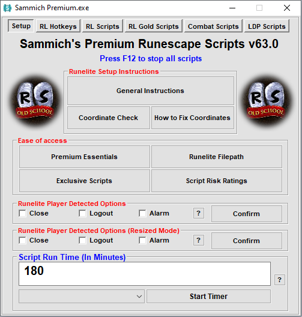

# Progress Update: RunescapeGPT - A Runescape ChatGPT Bot

## Introduction

RunescapeGPT is a project I started in order to create an AI-powered color bot for Runescape with enhanced capabilities. I have been working on this project for a few days now, and I am excited to share my progress with you all. In this post, I will be discussing what I have done so far and what I plan to do next.

## What I've Done So Far

### 2021-11-16

I have created a GUI for the bot using Qt Creator. It is a simple GUI that is inspired by Sammich's AHK bot. It has all the buttons provided by Sammich's bot.

Here is a screenshot of Sammich's GUI:

And here is the current state of RunescapeGPT's GUI:

Although the GUI is not fully functional yet, it lays a solid foundation. The next steps in development include adding actionable functionality to the buttons. Initially, we'll start with a single script that has a hotkey to send a screenshot to the AI model. This will be a key feature for monitoring the bot's activity and ensuring its smooth operation.

The script will capture the current state of the game, including what the bot is doing at any given time, and send this information along with a screenshot to the AI model. This multimodal approach will allow the AI to analyze both the textual data and the visual context of the game, enabling it to make informed decisions about the bot's next actions.

## Upcoming Features and Enhancements

- **Real-time Monitoring**: Integrate a system to always have a variable that reflects the bot's current action.
- **Activity Log and Reporting**: Keep a detailed log of the bot's last movement, including timestamps and the duration between actions, to identify and understand if something unusual occurs.
- **AI-Powered Decision Making**: In the event of anomalies or breaks, the information, including the screenshot, will be sent to an AI model equipped with multimodal capabilities. This model will analyze the situation and guide the bot accordingly.

By implementing these features, RunescapeGPT will become more than just a bot; it will be a sophisticated AI companion that navigates the game's challenges with unprecedented efficiency.

Stay tuned for more updates as the project evolves!
