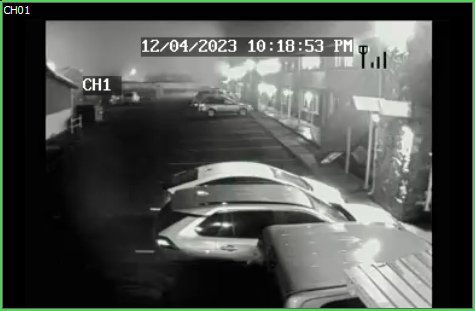

# Automating DVR Surveillance Feed Analysis Using Selenium and Python

## Introduction
In an era where security and monitoring are paramount, leveraging technology to enhance surveillance systems is crucial. Our mission is to automate the process of capturing surveillance feeds from a DVR system for analysis using advanced computer vision techniques. This task addresses the challenge of accessing live video feeds from DVRs that do not readily provide direct stream URLs, such as RTSP, which are essential for real-time video analysis.

## The Challenge
Many DVR (Digital Video Recorder) systems, especially older models or those using proprietary software, do not offer an easy way to access their video feeds for external processing. They often stream video through embedded ActiveX controls in web interfaces, which pose a significant barrier to automation due to their closed nature and security restrictions.

## Our Approach
To overcome these challenges, we propose a method that automates a web browser to periodically capture screenshots of the DVR's camera screens. These screenshots can then be analyzed using a computer vision model to transcribe or interpret the activities captured by the cameras. Our tools of choice are Selenium, a powerful tool for automating web browsers, and Python, a versatile programming language with extensive support for image processing and machine learning.

## Step-by-Step Guide

-  Setting Up the Environment
   Selenium WebDriver: Install Selenium WebDriver compatible with your intended browser.
   Python Environment: Set up a Python environment with the necessary libraries (selenium, datetime, etc.).
-  Browser Automation
   Navigate to DVR Interface: Use Selenium to open the browser and navigate to the DVR's web interface.
   Handle Authentication: Automate the login process to access the camera feeds.
-  Capturing Screenshots
   Regular Intervals: Implement a loop in Python to capture and save screenshots of the camera feed every five seconds.
   Timestamped Filenames: Save the screenshots with timestamps to ensure uniqueness and facilitate chronological analysis.
-  Analyzing the Captured Screenshots
   Vision Model Selection: Choose a suitable computer vision model for analyzing the screenshots based on the required analysis (e.g., object detection, and movement tracking).
   Processing Screenshots: Feed the screenshots to the vision model either in real-time or in batches for analysis.
-  Continuous Monitoring
   Long-term Operation: Ensure the script can run continuously to monitor the surveillance feed over extended periods.
-  Error Handling: Implement robust error handling to manage 
   browser timeouts, disconnections, or other potential issues.

##   Purpose and Benefits
   This automated approach is designed to enhance surveillance systems where direct access to video streams is not available. By analyzing the DVR feeds, it can be used for various applications such as:

Security Monitoring: Detect unauthorized activities or security breaches.
Data Analysis: Gather data over time for pattern recognition or anomaly detection.
Event Documentation: Keep a record of events with timestamps for future reference.

## Conclusion
While this approach offers a workaround to the limitations of certain DVR systems, it highlights the potential of integrating modern technology with existing surveillance infrastructure. The combination of Selenium's web automation capabilities and Python's powerful data processing and machine learning libraries opens up new avenues for enhancing security and surveillance systems.

### Important Note 
This method, while innovative, is a workaround and has limitations compared to direct video stream access. It is suited for scenarios where no other direct methods are available and real-time processing is not a critical requirement.
