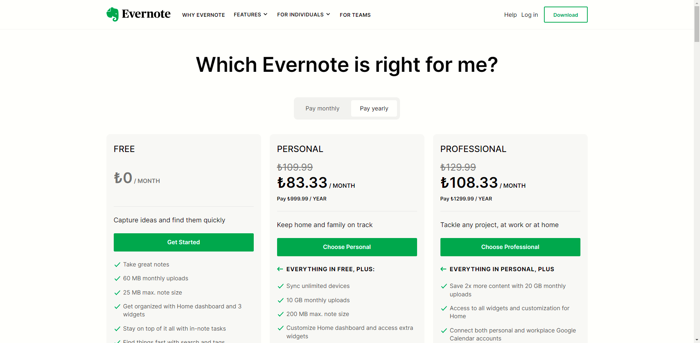
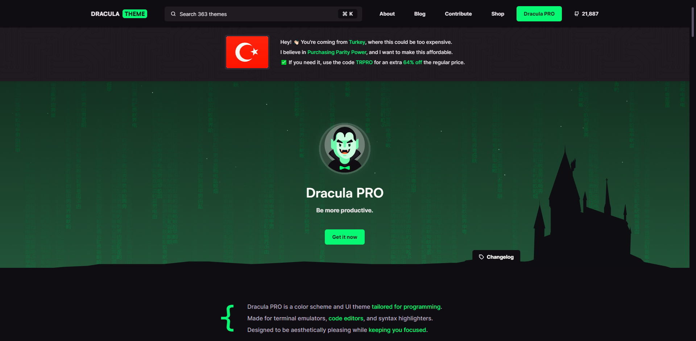

# Productivity Tools in 2024

## Notetaking and Task Management

In my attempt to cut down on subscriptions in 2024, I'll be switching to Microsoft Visual Studio Code with GitHub Copilot as my go-to AI assistant in helping me churn out more content for my blog and YouTube channel. 

I'll be switching to a productivity toolset consisting of Evernote with Kanbanote, Anki, Raindrop.io, and Google Calendar. I want to be more note-focused than ever with data-hungry Large Language Models (LLMs) becoming more of a norm.

I've gone through my personal Apple subscriptions and canceled all of them, these are separate from my shared family subscriptions such as Chaupal, a Punjabi, Bhojpuri, and Haryanvi video streaming service. I've also canceled my MidJourney and ChatGPT subscriptions. I intend on using fewer applications so I can utilize the most of what I have and if I do start using a new subscription service I'll be sure to buy residential Turkish proxies to get the best price whilst keeping my running total of subscriptions to a minimum.

Accordingly, some other subscription services I need to check Turkish pricing for are:

- [ ] ElevanLabs
- [ ] Grammarly
- [ ] Dropbox

To sum up my 2024 productivity stack:

- [x] Microsoft Visual Studio Code
- [x] GitHub Copilot
- [x] Evernote
- [x] Kanbanote
- [x] Raindrop.io
- [x] Google Calendar

Useful links:

1. [IP Burger for Turkish residential proxies](https://secure.ipburger.com/aff.php?aff=2219)
2. [Prepaid Credit Card for Turkish subscriptions](https://gamesupplement.com/game/Prepaid-Credit-Card-[TRY])

## Microsoft Visual Studio Code
Microsoft Visual Studio Code is a free source-code editor made by Microsoft for Windows, Linux, and macOS. 

## Password Manager
### [RoboForm](https://www.roboform.com/)
RoboForm is a password manager and form filler tool that automates password entering and form filling, developed by Siber Systems, Inc. It is available for many web browsers, as a downloadable application, and as a mobile application. RoboForm stores web passwords on its servers, and offers to synchronize passwords between multiple computers and mobile devices. RoboForm offers a Family Plan for up to 5 users which I share with my family.

## Theme

Dracula Theme is a dark theme for programs Alacritty, Alfred, Atom, BetterDiscord, Emacs, Firefox, Gnome Terminal, Google Chrome, Hyper, Insomnia, iTerm, JetBrains IDEs, Notepad++, Slack, Sublime Text, Terminal.app, Vim, Visual Studio, Visual Studio Code, Windows Terminal, and Xcode. 

With it's easy-on-the-eyes color scheme, Dracula Theme is on my list of must-have themes for any application I use.

