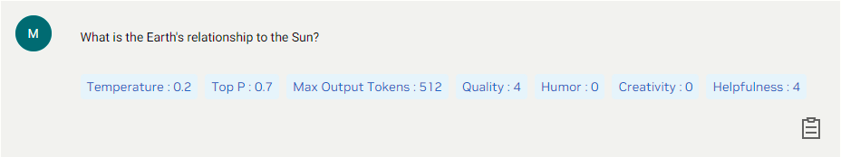

# NVIDIA's Nemotron-3-8B-Chat-SteerLM: Empowering Conversational AI with Stateful Text Generation

## Introduction

In the world of AI, language models have taken center stage for their ability to generate human-like text responses to a wide range of queries. NVIDIA's Nemotron-3-8B-Chat-SteerLM is one such model, offering a powerful tool for generative AI creators working on conversational AI models. Let's dive into the details of this model and understand how it works, its intended use, potential risks, and its unique feature of remembering previous answers.

## Model Overview

Nemotron-3-8B-Chat-SteerLM is an 8 billion-parameter generative language model based on the Nemotron-3-8B base model. It boasts customizability through the SteerLM method, allowing users to control model outputs dynamically during inference. This model is designed to generate text responses and code, making it a versatile choice for a range of applications.

### Intended Application & Domain

This model is tailored for text-to-text generation, where it takes text input and generates text output. Its primary purpose is to assist generative AI creators in the development of conversational AI models. Whether it's chatbots, virtual assistants, or customer support systems, this model excels in generating text-based responses to user queries.

### Model Type

Nemotron-3-8B-Chat-SteerLM belongs to the Transformer architecture family, renowned for its effectiveness in natural language processing tasks. Its architecture enables it to understand and generate human-like text.

### Intended User

Developers and data scientists are the primary users of this model. They can leverage it to create conversational AI models that generate coherent and contextually relevant text responses in a conversational context.

### Stateful Text Generation

One of the standout features of this model is its statefulness. It has the ability to remember previous answers in a conversation. This capability allows it to maintain context and generate responses that are not just coherent but also contextually relevant. For example, in a multi-turn conversation, it can refer back to previous responses to ensure continuity and relevancy.

## How the Model Works

Nemotron-3-8B-Chat-SteerLM is a large language model that operates by generating text and code in response to prompts. Users input a text prompt, and the model utilizes its pre-trained knowledge to craft a text-based response. The stateful nature of the model means that it can remember and consider the conversation history, enabling it to generate contextually appropriate responses. This feature enhances the conversational quality of the AI, making interactions feel more natural and meaningful.

## Performance Metrics

The model's performance is evaluated based on two critical metrics:

1. **Throughput:** This metric measures how many requests the model can handle within a given time frame. It is essential for assessing the model's efficiency in real-world production environments.

2. **Latency:** Latency gauges the time taken by the model to respond to a single request. Lower latency is desirable, indicating quicker responses and smoother user experiences.

### Potential Known Risks

It's crucial to be aware of potential risks when using Nemotron-3-8B-Chat-SteerLM:

- **Bias and Toxicity:** The model was trained on data from the internet, which may contain toxic language and societal biases. Consequently, it may generate responses that amplify these biases and return toxic or offensive content, especially when prompted with toxic inputs.

- **Accuracy and Relevance:** The model may generate answers that are inaccurate, omit key information, or include irrelevant or redundant text. This can lead to socially unacceptable or undesirable text, even if the input prompt itself is not offensive.

## Licensing

The use of this model is governed by the "NVIDIA AI Foundation Models Community License Agreement." Users must adhere to the terms and conditions outlined in the agreement when utilizing the model.

## Conclusion

NVIDIA's Nemotron-3-8B-Chat-SteerLM represents a significant advancement in generative AI for conversational applications. With its stateful text generation capability and Transformer architecture, it offers a versatile solution for developers and data scientists working in this domain. However, it's important to be mindful of potential biases and accuracy issues, as well as adhere to the licensing terms when utilizing this powerful AI tool.
