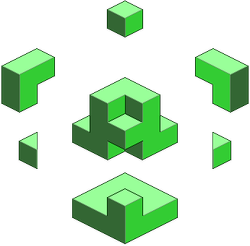

# Rendering 3D GitHub Contributions on AWS

## Introduction

In the rapidly evolving landscape of cloud computing and 3D rendering, innovative solutions are constantly being developed to handle complex tasks more efficiently. One such breakthrough is the use of AWS Lambda for rendering 3D scenes, particularly for projects where high scalability and quick turnaround times are crucial. This approach is especially relevant when dealing with a large volume of simpler assets that need to be rendered swiftly, leveraging the power of cloud computing.

The concept of running Blender, a popular open-source 3D graphics software, on AWS Lambda, presents a unique blend of flexibility and power. This method is ideal for scenarios where each asset is simple enough to be processed within the constraints of Lambda functions, which, as of my last update, offer up to 6 vCPUs and 10GB of RAM. For more complex rendering tasks, alternatives like EC2 instances or AWS Thinkbox Deadline might be more suitable due to their enhanced computational capabilities.

The inspiration for utilizing Blender on AWS Lambda came from discovering that a similar approach was successfully implemented by [Theodo](<[https://blog.theodo.com/](https://blog.theodo.com/2021/08/blender-serverless-lambda/)>) in 2021.

## Technology Stack

### Frontend Stack
The frontend of this project is developed with Reflex, a Python-based framework ideal for crafting interactive web applications. Reflex's key advantage lies in its ability to enable component reuse across both frontend and backend, crucial for a cohesive user experience. It also offers an extensive range of components for creating a responsive and interactive frontend.

Styling is achieved through Tailwind CSS, a utility-first framework that facilitates rapid, custom UI development. This choice is beneficial as it simplifies customization without the need for extensive CSS coding.

For hosting, the project utilizes Vercel, a cloud platform optimized for static sites and serverless functions. Vercel's strengths include easy deployment and efficient management of serverless functions, making it a fitting choice for the project's frontend needs. This combination of technologies ensures a streamlined, efficient, and aesthetically pleasing user interface.

| Language  | Python                                                        |
| --------- | ------------------------------------------------------------- |
| Framework | <a href='https://reflex.dev/docs/tutorial/frontend/#reusing-components' target="_blank">Reflex</a> |
| Styling   | <a href='https://tailwindcss.com/' target="_blank">Tailwind CSS</a>           |
| Hosting   | <a href='https://vercel.com/' target="_blank">Vercel</a>                      |

### Backend Stack

The project's backend is developed using Reflex, a Python-based framework ideal for building interactive web applications. Reflex's ability to facilitate component reuse across both frontend and backend significantly enhances the user experience. Additionally, it provides a variety of responsive and interactive components for frontend development.

For hosting, the backend utilizes AWS Lambda, a serverless computing service. This choice is advantageous due to its scalability and cost-effectiveness, as it only charges for the compute time used. The project also integrates Reflex Database, a NoSQL database optimized for Python, enabling straightforward data storage and retrieval without SQL. Furthermore, AWS S3 is employed for cloud storage, offering efficient data handling capabilities in Python without the need for SQL coding. This combination of technologies ensures a robust and efficient backend infrastructure for the project.

| Language  | Python                                                                                          |
| --------- | ----------------------------------------------------------------------------------------------- |
| Framework | <a href='https://reflex.dev/docs/tutorial/backend/#reusing-components' target="_blank">Reflex</a> |
| Hosting   | <a href='https://aws.amazon.com/lambda/' target="_blank">AWS Lambda</a>                          | 
| Database  | <a href='https://reflex.dev/docs/database/overview/' target="_blank">Reflex Database</a>         |            
| Other     | <a href='https://aws.amazon.com/s3/' target="_blank">AWS S3</a>                                  |

### Online IDE

The online IDE used for this project was Replit, a cloud-based IDE that allows you to code in Python, JavaScript, HTML, CSS, and more. Replit is a great choice for this project because it allows you to easily collaborate with others and share your code with the world.

- https://replit.com/@harmindersinghnijjar/Bute-3D-GitHub-Contributions

## Render Pipeline
<iframe style="border:none" width="800" height="900" src="https://whimsical.com/embed/SEAYWpZma1EWF7A1khYyZi"></iframe>

The depicted render pipeline represents a sophisticated, cloud-based 3D rendering process, leveraging AWS services and Blender's capabilities. This pipeline is designed to efficiently handle 3D rendering requests, process them using cloud resources, and deliver the final product back to the user. Below is a detailed description of each step in this pipeline:

-  User Request Initiation: The process begins with the user initiating a 3D rendering request. This is typically done through an API endpoint, which acts as the interface between the user and the cloud-based rendering system.

- API Endpoint: Upon receiving a request, the API endpoint acts as a gateway, funneling the user's requirements into the AWS ecosystem. This step is crucial for interpreting the user's request and preparing the system for the subsequent data retrieval process.

- Data Retrieval: This stage involves fetching the necessary information required for the 3D rendering task. The data retrieval process is a critical component, ensuring that all the required elements, such as textures, models, and other assets, are gathered and ready for processing.

- Blender on AWS Lambda: Once the data is retrieved, it is sent to Blender, which is hosted on AWS Lambda. AWS Lambda provides a serverless compute service, allowing Blender to run in a highly scalable, event-driven environment. This setup is particularly efficient for handling varying loads and can scale up or down based on the complexity of the rendering tasks.

- 3D Replication Creation: In this phase, Blender processes the data to create a 3D replication. This step involves the actual rendering process where Blender utilizes its powerful 3D graphics tools to generate the desired 3D graphical files.

- Uploading to AWS S3 Bucket: After the rendering is complete, the 3D graphical files are uploaded to an AWS S3 bucket. S3 provides secure, scalable object storage, making it an ideal choice for storing large files like 3D renders. The use of S3 ensures that the rendered files are stored safely and are easily accessible for download.

- User Download: Finally, the link to the rendered 3D graphical files in the S3 bucket is sent back to the user. This completes the full cycle of the rendering process, allowing the user to download the final product directly from the cloud.

This full-cycle 3D rendering process on AWS exemplifies a modern, cloud-based approach to 3D graphics production. It highlights the integration of serverless computing, cloud storage, and powerful rendering software to deliver a seamless, scalable, and efficient 3D rendering service.
